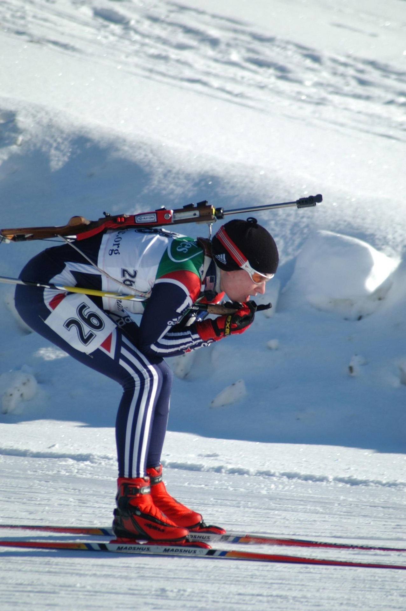

# Roboflow Supervision - Keypoint Muting Experiment

This is an attempt to understand how Roboflow's [Supervision](https://github.com/roboflow/supervision) works.

The experiment was inspired from the issue opened on [roboflow/supervision#1676](https://github.com/roboflow/supervision/issues/1676).

The utility of the proposed method `with_threshold` in `KeyPoints` was not clear to me, as in how setting low-threshold keypoints to `0` helps in vizualizing skeletons with low confidence.

Hence, I tried to understand it by illustrating it.

## Output

### Example 1

**[Original Image](https://pixabay.com/photos/soccer-competition-football-stadium-3311817/)**

**Output**

https://github.com/user-attachments/assets/e3a6dedd-95e8-4ce1-936b-6a2d5c089bb3

### Example 2

**[Original Image](https://pixabay.com/photos/ski-skier-sports-downhill-slope-79564/)**

**Output**

https://github.com/user-attachments/assets/02f27c56-6d55-4a49-bbb7-9aeecb612010

### Example 3

**[Original Image](https://pixabay.com/photos/runners-male-sport-run-athlete-373099/)**

**Output**

https://github.com/user-attachments/assets/62c5a34b-c522-446a-a102-ca2d8b82625c

### Example 4

**[Original Image](https://pixabay.com/photos/sumo-wrestler-athlete-wrestler-hall-3196753/)**

**Output**

https://github.com/user-attachments/assets/dfb5569a-050a-43c5-84a9-1bf50139d4ff

Images used are free and permitted. Credits: [Pixabay](https://pixabay.com)
